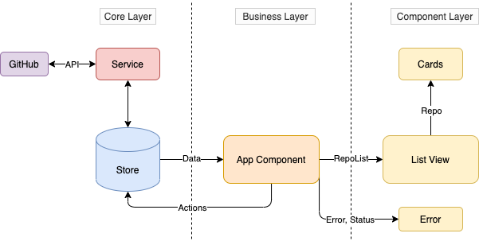

# Trending Repos

Trending Repos is a simple web application that makes use of the GitHub
API to display the most recently created repositories that have the 
highest stars. The application also uses a dynamic loading feature where
more repositories are fetched when scrolling to the bottom of the website.
The user can also visit the repository by clicking on the repository name.

# How to run

- Requirements
  - NPM
  - Angular CLI

- Clone the repository on your local system
   ```shell
   $ git clone https://github.com/hrishikeshpaul/trending-repos.git
   $ cd trending-repos
   ```

- Start development server
   ```shell
   $ npm install
   $ ng serve -o 
   ```

- For production
  ```shell
  $ ng deploy --base-href=https://<username>.github.io trending-repos/ --name=<name> --email=<email>
  ```

# Documentation

## Packages
- Angular 9: Front-end framework
- NGXS: State management
- Bootstrap: Styling library
- MomentJS: Date formatting
- AOS: Animations

## Workflow

### State Management (Core Layer)

The application makes use of a state management system which keeps track of 
  - the data fetched from GitHub, 
  - the page numbers, 
  - whether the data is being fetched (loading)
  - and the errors (if any)

This interacts with the Repo Service which makes interacts with the backend (GitHub) via the mentioned API. It also uses an URL builder function that takes in the last 30 day's date and the page number for the API's query parameters.

### App (Business Layer)

This specifies how the data should be used, and when the data
should be brought in from the state manager. It also maintains a scroll watcher to fetch the data with the next page number once the scroll bar has reached the bottom (by perfoming an action). Lastly, it observes the status, errors and the data and passes it on to the next layer. Therefore, this maintains an unidirectional flow of data.

### Dumb Components (Component Layer)

The application makes use of 2 dumb componenets - list and repo-card. These componenets are purely defined by their inputs and does not depend on each other. This keeps the code modular and testing/debugging can be simpler. The list component accepts data from the App component and passes each data object (repository data in this case) to the card. 

Diagram below depics the workflow,





